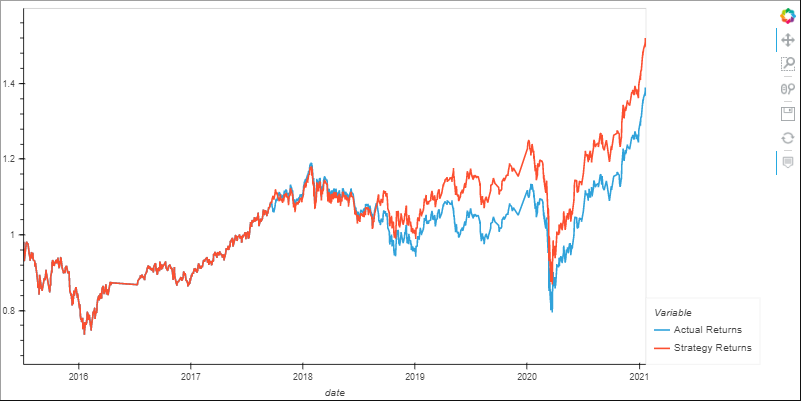

# Machine_Learning_Trading_Bot
## Summary
In this program, the user will compare two machine learning algorightms to analyze, which algorithm offers the best prediction for making trading decisions utilizing different parameters. 

## Baseline Trading  
 