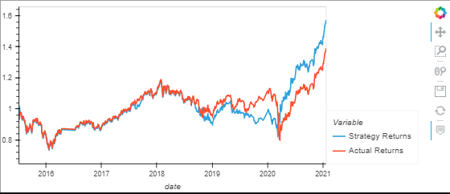

# Machine_Learning_Trading_Bot
## Summary
In this program, the user will compare two machine learning algorightms to analyze, which algorithm offers the best prediction for making trading decisions utilizing different parameters. 

## Baseline Trading  
   
 The image above demonstrates the algorithm base strategy. This strategy predicts an early entry leaving the individual using it in drawdown or hitting stop loss before the actual charct takes off. The more volatile it becomes the difference between the actual and strategy increases. 
## AdaBoost Classifier  
  
In the second trading algorithm, allows for a better entry, and a more accurate prediction on the actual return on investmennt in the long run. 